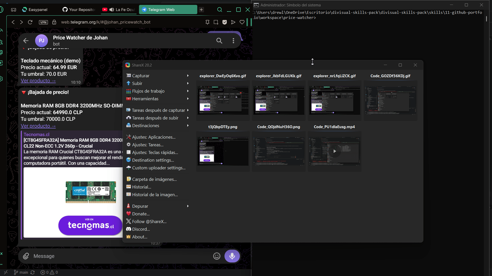

# 🛒 Price Watcher

> Vigila el precio de los productos que te interesan y te avisa por Telegram en cuanto bajan del umbral que tú decides. Python para la lógica, n8n para la automatización.


## ¿Qué hace?

Comprar caro porque no te enteraste de que el producto estaba en oferta es de las cosas más fáciles de automatizar. **Price Watcher** consulta el precio de una lista de productos que tú defines, lo compara con tu precio objetivo y con el último precio visto, y te manda una alerta a Telegram cuando merece la pena comprar.

Está diseñado para funcionar de dos formas con el mismo código:

- **Como script** programado con cron (el propio Python envía la alerta).
- **Como parte de un workflow de n8n**, donde Python solo extrae los datos y n8n decide a quién y cómo avisar (Telegram, email, Slack…).

## Demo

<!-- Añade aquí tu GIF: graba `python src/main.py --demo` + la alerta llegando a Telegram. Ver docs/DEMO.md -->


## Tecnologías

| Capa | Herramienta |
|---|---|
| Lógica y scraping | Python (`requests`, `BeautifulSoup`) |
| Configuración | JSON + variables de entorno (`python-dotenv`) |
| Notificaciones | API de Telegram Bot |
| Orquestación | n8n (Schedule Trigger) o cron |

## Instalación

```bash
# 1. Clona e instala dependencias
git clone https://github.com/<tu-usuario>/price-watcher.git
cd price-watcher
pip install -r requirements.txt

# 2. Configura tus productos
cp config.example.json config.json     # edita la lista de productos y umbrales

# 3. Configura tu bot de Telegram (opcional, para alertas reales)
cp .env.example .env                    # pega tu TELEGRAM_BOT_TOKEN y TELEGRAM_CHAT_ID
```

> En Windows usa `copy` en lugar de `cp`.

## Uso

```bash
# Consulta los precios y envía alertas por Telegram si hay bajadas
python src/main.py

# Imprime los resultados en JSON (para consumir desde n8n) sin enviar nada
python src/main.py --json

# Prueba con datos simulados, sin red ni configuración
python src/main.py --demo
```

### Definir qué vigilar (`config.json`)

```json
{
  "products": [
    {
      "name": "Teclado mecánico",
      "url": "https://tienda.com/producto/teclado",
      "css_selector": "[itemprop='price']",
      "currency": "EUR",
      "target_price": 79.99
    }
  ]
}
```

El `css_selector` apunta al elemento HTML que contiene el precio en esa tienda. Acepta varios selectores separados por coma (usa el primero que encuentre).

## Automatizar con n8n

1. Importa `workflow.json` en n8n (`Workflows → Import from File`).
2. Conecta tu credencial de Telegram en el nodo *Avisar por Telegram*.
3. Ajusta la ruta del script en el nodo *Ejecutar Price Watcher*.
4. Activa el workflow: cada 6 horas chequea precios y te avisa solo si hay bajadas.

```
Schedule Trigger → Ejecutar script (--json) → Filtrar bajadas → Telegram
```

Ver el diagrama completo en [`docs/arquitectura.md`](docs/arquitectura.md).

## Arquitectura

Lógica (Python) separada de la orquestación (n8n/cron): el mismo código sirve como script suelto o como nodo de un workflow. El estado se guarda en `data/state.json` para distinguir "está bajo el umbral" de "acaba de bajar". Detalle en [`docs/arquitectura.md`](docs/arquitectura.md).

## Roadmap

- [x] Scraping de precios con selector configurable
- [x] Alertas por Telegram
- [x] Modo `--json` para integración con n8n
- [x] Modo `--demo` sin dependencias externas
- [ ] Soporte para tiendas con precio cargado por JavaScript (Playwright)
- [ ] Histórico de precios con gráfica de evolución
- [ ] Panel web con los productos vigilados

## Licencia

MIT
